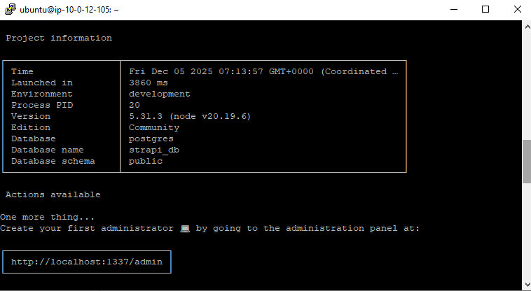
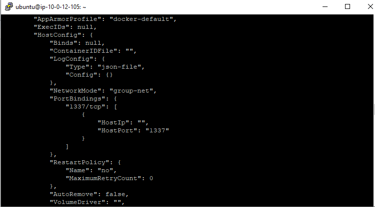

## Set up a Dockerized environment

[Task explanation loom video link](https://www.loom.com/share/ad684e62f5694b5fb6ab470bb21823a9)

### 🟢 Step 1: First create docker network to run these 3 container on same network.
sudo docker network create group-net

### Important, Before build the strapi docker image here we are going to use the postgresql, So, do this changes on package.json

### Remove "better-sqlite3": "12.4.1" and add "pg": "^8.11.0"
 
    "dependencies": {
      "@strapi/plugin-cloud": "5.31.3",
      "@strapi/plugin-users-permissions": "5.31.3",
      "@strapi/strapi": "5.31.3",
      "pg": "^8.11.0" 
      "react": "^18.0.0",
      "react-dom": "^18.0.0",
      "react-router-dom": "^6.0.0",
      "styled-components": "^6.0.0"
    },

### 🟢 Step 2: Now, we want Strapi, Postgresql and nginx docker images to launch a continer. So, Using pull the Postgresql and nginx images from dockerhub.
sudo docker pull posgresql && sudo docker pull nginx

### 🟢 Step 3: I already have a strapi docker image on my machine. So, I didn't pull this image from dockerhub.

### 🟢 Step 4: Let's launch a docker container for postgresql using docker image. and metion the username, password. Here we mentioned the same network for these 3 containers.
using --network option.

    sudo docker run -d \
      --name strapi-postgres \
      --network group-net \
      -e POSTGRES_USER=strapi \
      -e POSTGRES_PASSWORD=strapi123 \
      -e POSTGRES_DB=strapi_db \
      -v strapi-pgdata:/var/lib/postgresql/data \
      postgres:15

### 🟢 Step 5: Launch a another container for strapi with the neccessary credentials and connect the postgresql.
    sudo docker run -d \
      --name strapi \
      --network group-net \
      -p 1337:1337 \
      -e DATABASE_CLIENT=postgres \
      -e DATABASE_HOST=strapi-postgres \
      -e DATABASE_PORT=5432 \
      -e DATABASE_NAME=strapi_db \
      -e DATABASE_USERNAME=strapi \
      -e DATABASE_PASSWORD=strapi123 \
      -e APP_KEYS=myAppKey \
      -e API_TOKEN_SALT=mySalt \
      -e ADMIN_JWT_SECRET=myAdminJWT \
      -e JWT_SECRET=myJWT \
      strapi:latest
      
Using the node install the "npm install -g yarn" because using this yarn we are going to build and develop the strapi.

### 🟢 Step 6: Before Launch the nginx container, make a dir and setup a nginx.conf file for reverse proxy.
mkdir nginx
nginx/nginx.conf

    events {}
    
    http {
        server {
            listen 80;
                location / {
                proxy_pass http://strapi:1337;
                proxy_set_header Host $host;
                proxy_set_header X-Real-IP $remote_addr;
                proxy_set_header X-Forwarded-For $proxy_add_x_forwarded_for;
            }
        }
    }

### 🟢 Step 7 : Then launch a another container for nginx. while create the container mentione the what we created the nginc.conf file.

    sudo docker run -d \
      --name strapi-nginx \
      --network group-net \
      -p 80:80 \
      -v /home/ubuntu/nginx/nginx.conf:/etc/nginx/nginx.conf \
      nginx:latest

### 🟢 Step 6: We successfully created everything, now we are going test from the web.
http://instance-ip:1337

### 🟢 Step 7: Now, Let's verify the strapi container connected with postgresql or not. You can see the logs and network details for strapi container.
    sudo docker logs strapi
    
http://instance-ip:1337

### 🟢 Step 8: To check on which network your container is running. using inspect command you can check
sudo docker inspect strapi

